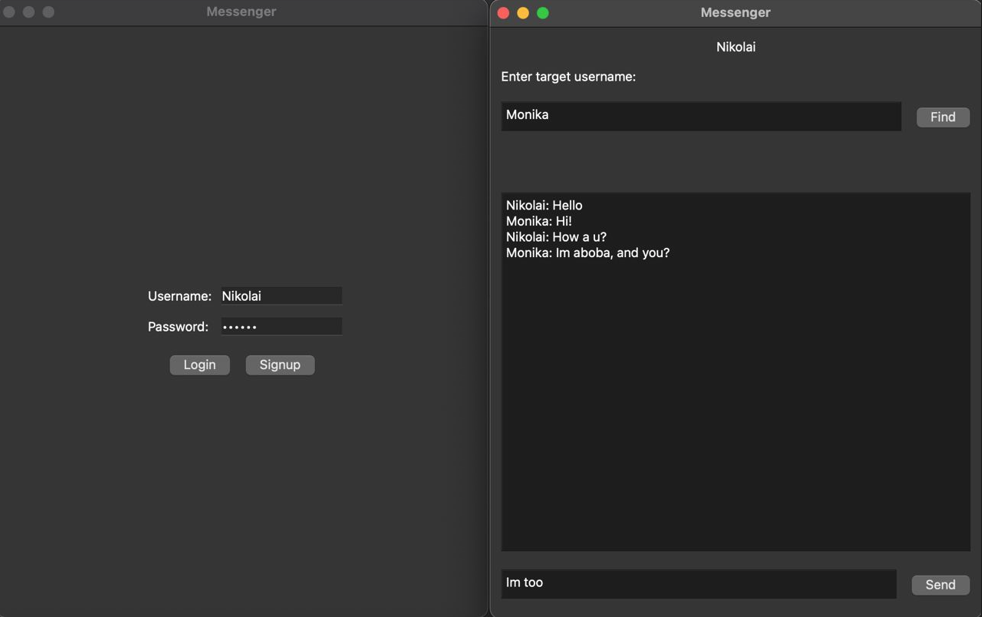

# Local C++ messenger written in Qt6(QTcpServer) and PostgreSQL.

[Русская версия находится в папке materials/]

### Application architecture diagram:

#### Client
***Client*** class encapsulates ***authorization*** and ***messenger*** widgets. The ***authorization*** class contains only signals and slots for working with the authorization interface. The ***messenger*** class contains communication with the server and the messenger interface.

#### Server
The ***server*** contains all the functions for processing input values from the client and writing them to the database, as well as transferring data from the database to the client. There is a separate ***utilities*** class for the server to help the server work, it contains a set of functions different from network ones.

### Database architecture diagram:

The users table from the non-obvious stores the current socket (token) of the session. It is needed so that the sender and recipient receive messages in real time without reloading the session. You can find the sources of the SQL tables in the `materials/` folder!
